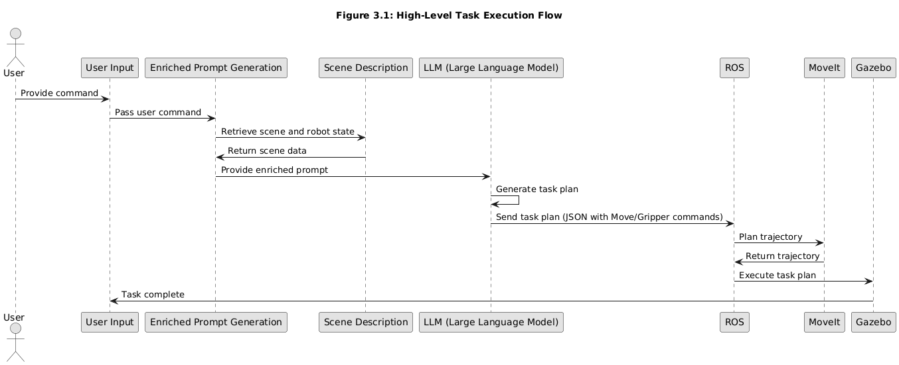
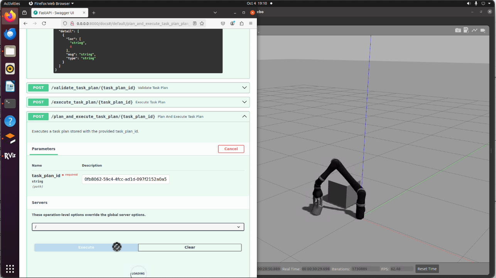
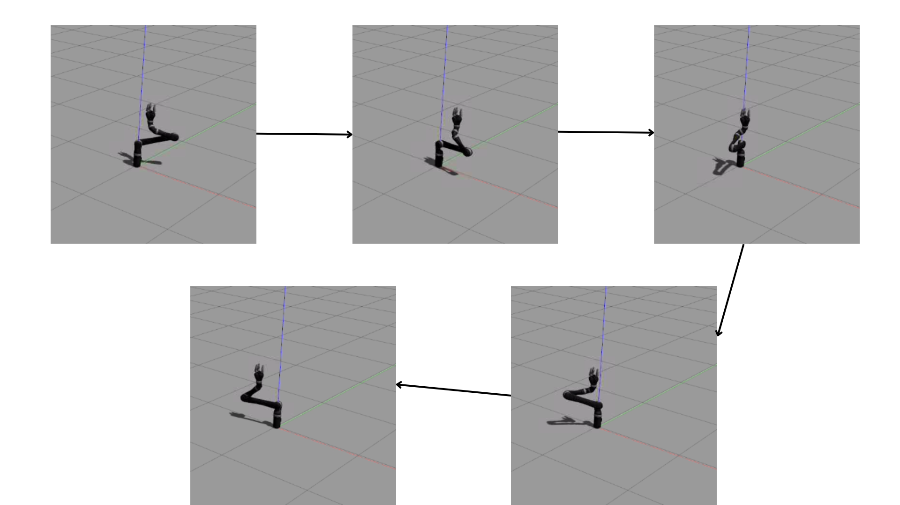
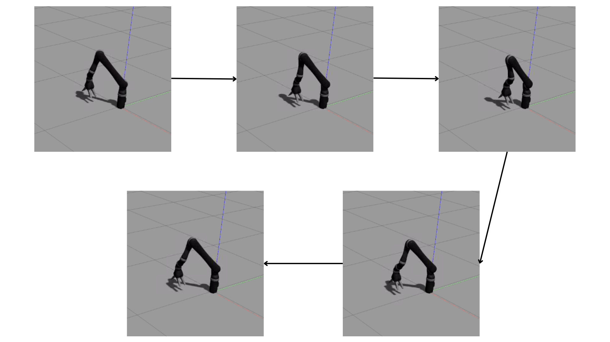
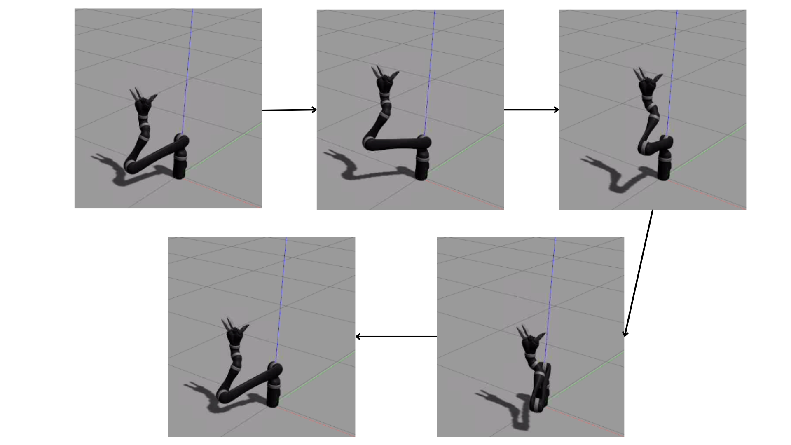

# Using LLMs for End-User Friendly Robot Control

This project was developed during my Master Thesis. It demonstrates a way to integrate LLMs with a Robotic arm. It allows users to provide natural language instruction, then converts them into task plans and finally executes the task plans.

## Prerequisites

- ROS Noetic (Robot Operating System) installed
- Virtual environment set up
- Install requirements using `requirements.txt`:
    ```sh
    pip install -r requirements.txt
    ```

## Setup and Launch

1. Activate the virtual environment and source the setup file:
    ```sh
    source venv/bin/activate && source devel/setup.bash
    ```

2. Start the ROS core:
    ```sh
    roscore
    ```

3. Launch the robot in Gazebo:
    ```sh
    roslaunch kinova_gazebo robot_launch.launch kinova_robotType:=j2n6s300
    ```

4. Launch the MoveIt configuration for the robot in Gazebo:
    ```sh
    roslaunch j2n6s300_moveit_config j2n6s300_gazebo_demo.launch
    ```

5. Relay the joint states topic:
    ```sh
    rosrun topic_tools relay /j2n6s300/joint_states /joint_states
    ```

6. Launch the llmbot remote:
    ```sh
    roslaunch llmbot_remote llmbot_remote.launch
    ```

## Usage

The last command will launch a FastAPI server on port 8000. You can interact with the server using the following endpoints:

- Generate a task plan:
    ```http
    POST /generate_task_plan
    ```

- Plan and execute the task plan:
    ```http
    POST /execute_task_plan/{task_plan_id}
    ```
## System Overview

This project demonstrates an approach to integrating Large Language Models (LLMs) with a Kinova Jaco robotic arm to enable end-user friendly control via natural language. The system integrates ROS and MoveIt for motion planning and allows users to issue high-level commands, which are translated into executable robotic tasks.



*Figure 1: High-level system architecture of the robotic control system.*

## Task Execution Flow

The system follows the following flow from user input to final execution of the task:

1. User provides natural language commands.
2. The system generates a task plan using the LLM.
3. The plan is executed by the robotic arm through ROS and MoveIt.



*Figure 2: Flow of task execution.*

## Experiments and Results

We evaluated the performance of the system on various shape movements such as drawing circles, triangles, and squares. The system successfully completed most tasks with few inaccuracies.



*Figure 3: Example of the robotic arm drawing a circle in simulation.*



*Figure 4: Example of the robotic arm drawing a triangle.*



*Figure 5: Example of the robotic arm drawing a square.*

